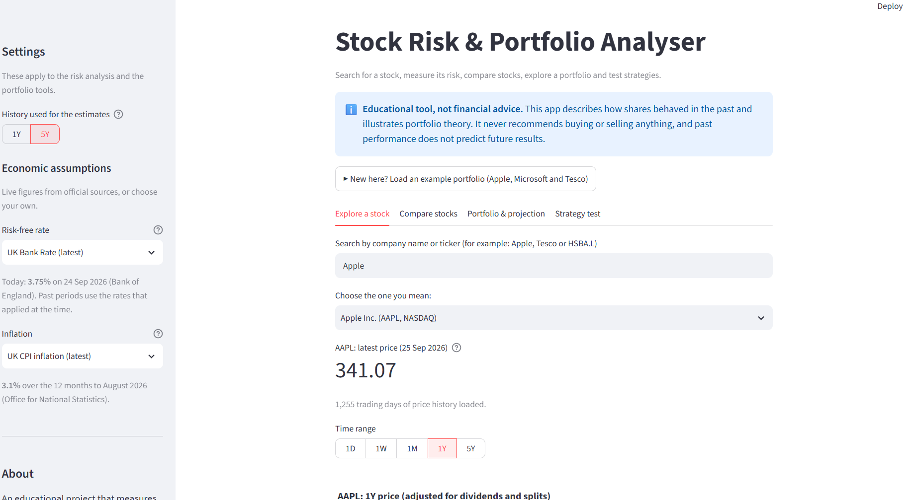
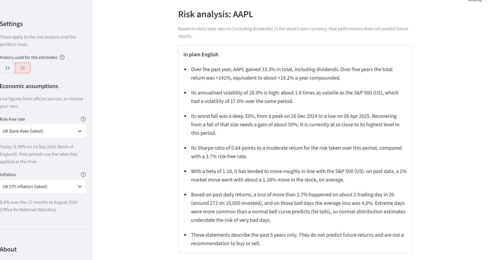
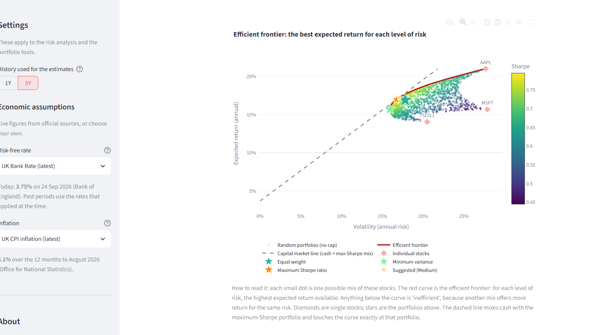
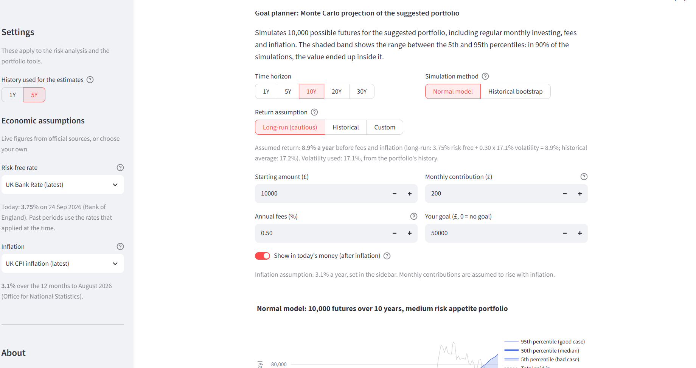
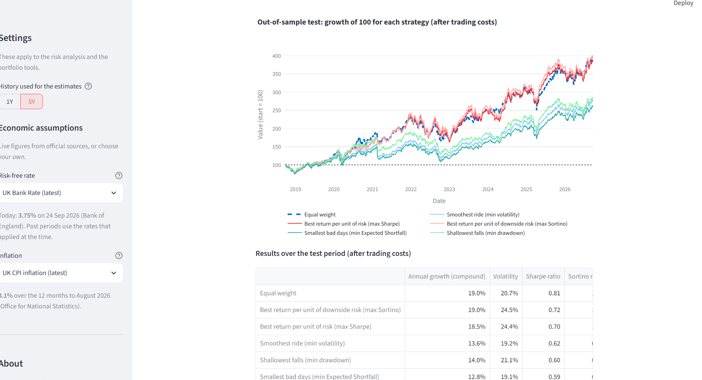

# 📈 Stock Risk & Portfolio Analyser

An interactive web app, built in Python with Streamlit, that measures the risk of shares, builds and stress-tests portfolios, and projects savings goals, while being honest about what past data can and can't tell you.

**Live app:** *link coming soon*

> ⚠️ **Educational tool, not financial advice.** The app describes how shares behaved in the past and illustrates portfolio theory. It never recommends buying or selling anything, and past performance does not predict future results.



---

## What it does

The app has four tabs, plus a sidebar of shared settings. A one-click **example portfolio** (Apple, Microsoft and Tesco) fills every tab straight away.

**1. Explore a stock**
- Search by company name or ticker, for UK, US and other markets, with friendly handling of invalid tickers.
- Interactive price charts with **1D, 1W, 1M, 1Y and 5Y** views (intraday data for the short ranges).
- A risk analysis on demand: returns over each period, **annualised volatility**, **maximum drawdown**, **Sharpe ratio**, **beta** and correlation against a chosen market index, and **1-day Value at Risk and Expected Shortfall** at 95% or 99%, each calculated two ways (historical and parametric).
- A **plain-English summary** generated by transparent rules (no AI), for example: *"Its worst fall was a deep 34%... recovering needs a gain of about 52%."*



**2. Compare stocks**
- Several stocks on one chart, each **rebased to 100**, so shares with different prices and currencies can be compared.

**3. Portfolio & projection**
- **Mean-variance optimisation** (Modern Portfolio Theory): a suggested split for a low, medium or high **risk appetite**, alongside the minimum-variance and maximum-Sharpe portfolios, with an optional cap per stock.
- The **efficient frontier**, 2,000 random portfolios and the **capital market line**.
- A correlation heatmap showing where the diversification benefit comes from.



- A **goal planner**: a Monte Carlo projection of 10,000 possible futures with a starting amount, **monthly contributions**, **fees** and **inflation**. It shows results in **today's money** and the **chance of reaching a goal**, using two simulation methods side by side.



**4. Strategy test**
- An **out-of-sample (walk-forward) backtest** of six strategies over up to 10 years, with **trading costs**: equal weight, minimum volatility, maximum Sharpe, maximum Sortino, minimum Expected Shortfall and minimum drawdown. At each rebalance, every strategy only sees data that was available **at the time**.



**Sidebar: shared settings with live data**
- The **risk-free rate**: the latest **UK Bank Rate** (Bank of England), the **US 3-month Treasury bill** yield, or a custom value.
- **Inflation**: the latest **UK CPI** (Office for National Statistics), the Bank of England's 2% target, or a custom value.
- Each live figure shows its **source and date**, and a *Data sources and assumptions* panel lists everything that is live data and everything that is a chosen assumption.

---

## Methodology

All returns use prices **adjusted for dividends and stock splits** (total returns), in each stock's own currency.

**Returns and volatility.** Daily returns are $r_t = P_t / P_{t-1} - 1$. Annualised volatility is

$$\sigma_{\text{annual}} = \sigma_{\text{daily}} \times \sqrt{252}$$

because, if daily returns are independent with equal variance, variances add over the roughly 252 trading days in a year. (Volatility clustering means this is an approximation.)

**Maximum drawdown.** The largest fall from a running peak: $\min_t \left( P_t / \max_{s \le t} P_s - 1 \right)$.

**Sharpe and Sortino ratios.** Sharpe $= (\bar r \times 252 - r_f) / \sigma_{\text{annual}}$. Sortino replaces volatility with downside deviation, so only returns below the risk-free rate count as risk. The risk-free rate $r_f$ is the **average rate that actually applied over the same period**, taken from the Bank Rate or Treasury bill history, rather than today's rate.

**Beta.** $\beta = \mathrm{Cov}(r_s, r_m) / \mathrm{Var}(r_m) = \rho \, \sigma_s / \sigma_m$, the slope of the stock's daily returns regressed on the market's. $R^2 = \rho^2$ shows how much of the stock's movement the market explains. If $R^2 < 5\%$, the summary reports that beta isn't meaningful for that index.

**Value at Risk and Expected Shortfall (1 day).**
- *Historical:* VaR is minus the 5th percentile of past daily returns (1st percentile at 99%). ES is the average loss beyond it.
- *Parametric (normal):* $\text{VaR} = z\sigma - \mu$ and $\text{ES} = \sigma \, \varphi(z) / \alpha - \mu$, where $z \approx 1.645$ at 95%.
- The app also reports **excess kurtosis** and how often returns breached the normal VaR, to show where fat tails make the normal model understate risk.

**Portfolio optimisation.** Expected returns are $\mu = \bar r \times 252$, and the covariance matrix is $\Sigma = \mathrm{Cov}(r) \times 252$. Portfolio return is $w^\top \mu$ and volatility is $\sqrt{w^\top \Sigma w}$. Weights are found with SciPy's SLSQP optimiser, subject to $\sum w_i = 1$ and $0 \le w_i \le \text{cap}$ (no short-selling). The risk appetite maximises the mean-variance utility

$$U = w^\top \mu - \tfrac{1}{2} A \, w^\top \Sigma w$$

with risk aversion $A = 10$ (low), $4$ (medium) or $1.5$ (high). The efficient frontier is traced by minimising variance at 40 target returns.

**Goal planner (Monte Carlo).** 10,000 monthly paths, with a fixed random seed so results are reproducible.
- *Normal model* (geometric Brownian motion): monthly log-returns are normal with mean $(\mu - \tfrac{1}{2}\sigma^2)/12$ and standard deviation $\sigma/\sqrt{12}$. The $-\tfrac{1}{2}\sigma^2$ term is the "volatility drag" that turns an arithmetic average into compound growth.
- *Historical bootstrap:* resamples the portfolio's real past monthly returns, re-centred on the same assumed average, so the two methods differ only in the **shape** of the returns. The gap between them is a simple measure of **model risk**.
- **Return assumption:** by default, a cautious long-run figure, today's risk-free rate $+ \, 0.30 \times \sigma$ (a long-run Sharpe ratio of 0.30). The portfolio's historical average is also available, with a warning, because a few strong years produce unrealistic long-term projections. Volatility is taken from history, since risk is estimated far more reliably than average return.
- Contributions rise with inflation, fees are taken monthly, and amounts can be shown in today's money.

**Strategy test (walk-forward backtest).** At each rebalance date (every 6 or 12 months), every strategy chooses its weights using only the previous 1 to 3 years of data, then holds them (letting them drift with prices) until the next rebalance. Trading costs are charged on turnover. The path-dependent objectives (drawdown, Expected Shortfall) are optimised from several starting points, because they are "bumpy".

---

## How it was checked

- **Optimiser against a closed-form answer:** for a two-stock portfolio, the minimum-variance and maximum-Sharpe weights matched hand calculations to within 0.1 percentage points.
- **Simulation against the exact formula:** for a lump sum, the simulated median matched the exact lognormal result to within about 0.2%.
- **Known-answer checks** for the goal planner (contributions only, fees only, inflation only), and a check that the walk-forward test respects caps and charges costs correctly.
- **Live data reconciled** against the Bank of England and ONS websites, and the file readers tested against the official download formats.
- **Regression test after refactoring:** the old single-file version and the new modular version were run through 7 scenarios and produced exactly the same page.

---

## Project structure

```
stock-risk-analyser/
├── app.py              # entry point: lays out the page (sidebar, disclaimer, tabs)
├── views/              # what the user sees, one file per part of the page
│   ├── common.py         # shared settings, disclaimer, small helpers
│   ├── sidebar.py        # settings and live economic data
│   ├── explore_tab.py    # tab 1: search, charts, risk analysis
│   ├── compare_tab.py    # tab 2: comparison chart
│   ├── portfolio_tab.py  # tab 3: optimisation and efficient frontier
│   ├── goal_planner.py   # tab 3: Monte Carlo goal planner
│   └── strategy_tab.py   # tab 4: walk-forward strategy test
├── data.py             # downloads: prices (yfinance), Bank Rate, CPI, T-bill yields
├── metrics.py          # risk and return measures
├── summary.py          # rule-based plain-English summary
├── portfolio.py        # portfolio maths and optimisation
├── montecarlo.py       # simulations for the goal planner
├── backtest.py         # walk-forward strategy test
├── charts.py           # Plotly charts
├── screenshots/        # images used in this README
└── requirements.txt    # libraries needed
```

The calculation modules contain no page code, so they can be reused or tested on their own.

---

## Running it on your own computer

You need **Python 3.12 or newer** (it was developed with Python 3.14). In a terminal:

```bash
git clone https://github.com/dimitracharalambidou14-del/stock-risk-analyser.git
cd stock-risk-analyser
python -m venv .venv
```

Activate the virtual environment. On **Windows (PowerShell)**:

```powershell
.\.venv\Scripts\Activate.ps1
```

On **macOS or Linux**:

```bash
source .venv/bin/activate
```

Then install the libraries and start the app:

```bash
python -m pip install -r requirements.txt
streamlit run app.py
```

The app opens in your browser at `http://localhost:8501`. (If you don't use Git, you can download the project with **Code → Download ZIP** on this page instead of `git clone`.)

---

## Data sources

| Data | Source |
|---|---|
| Share and index prices, company search | Yahoo Finance, via the free [yfinance](https://github.com/ranaroussi/yfinance) library |
| UK Bank Rate | Bank of England database (series IUDBEDR) |
| US 3-month Treasury bill yield | Yahoo Finance (^IRX) |
| UK CPI inflation | Office for National Statistics (series D7G7) |

All sources are free and need no API keys. Data is cached (prices for up to an hour, economic data for 12 hours), and if an economic figure can't be downloaded, the app says so and uses a clearly labelled fallback.

---

## Limitations

- **The past is not a forecast.** Every measure is estimated from history. Expected returns in particular are very uncertain: five years of data gives an estimate with a margin of error of roughly ±10 percentage points a year for a single stock.
- **Optimisers amplify estimation error.** Mean-variance weights can be extreme and unstable. The walk-forward test shows how optimised portfolios compare with simple equal weighting on data they haven't seen.
- **Fat tails.** The normal-distribution methods (parametric VaR, the normal Monte Carlo model) understate extreme losses. The historical methods are shown alongside for that reason.
- **Hindsight in stock selection.** Users pick stocks they know today, which tend to be the ones that did well (a form of survivorship bias).
- **Currency, tax and costs.** Returns are in each stock's own currency, and currency movements are not modelled. Tax wrappers (ISAs, pensions) and taxes are ignored. Trading costs appear only in the strategy test, and fees only in the goal planner.
- **Free data.** Yahoo Finance is unofficial, and can be delayed, occasionally wrong, or unavailable.
- **Short-term rates.** The risk-free rate is a short-term rate. Long-term plans might be better served by long-term government bond yields.

## Ideas for future improvements

- Automated tests (pytest) for the calculations and a continuous-integration check on every change.
- A weekly **risk and goal digest** by email (drawdown alerts, rebalancing reminders, goal progress), scheduled with GitHub Actions.
- Converting all returns into pounds, to capture currency risk for a UK investor.
- Long-term gilt yields as the discount rate for long horizons.
- A built-in backup dataset, so the demo still works if Yahoo Finance is unavailable.

---

## Built with

Python · Streamlit · pandas · NumPy · SciPy · Plotly · yfinance · requests

**Author:** *your name* · *link to your LinkedIn profile*
